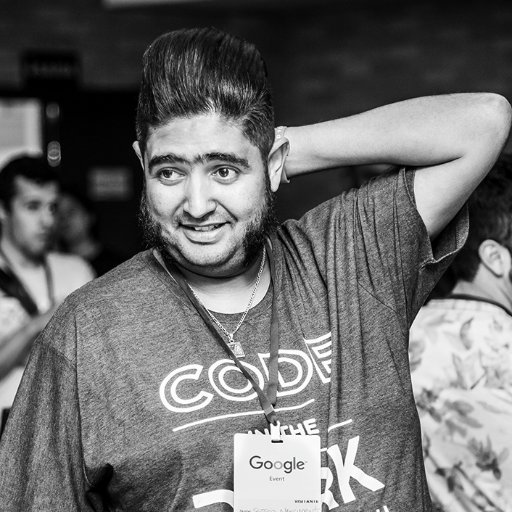
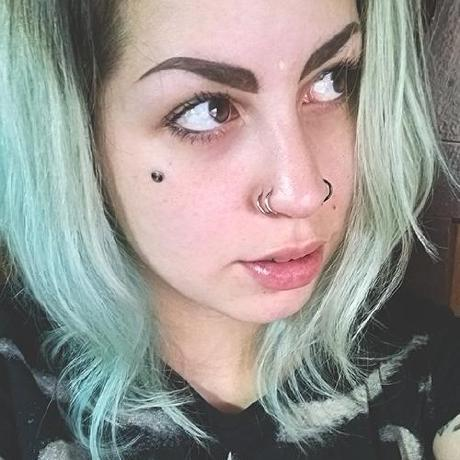
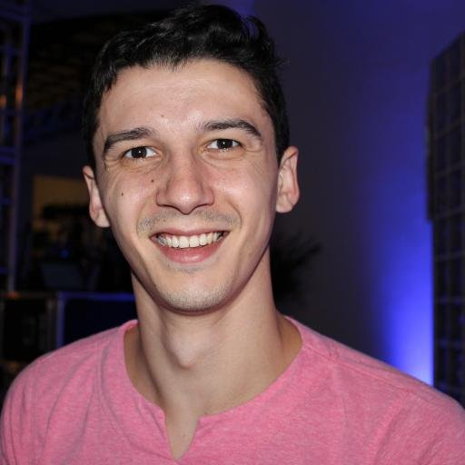

# Media Kit FrontInSampa 2017
## 01 Julho - Sábado
### [www.frontinsampa.com.br](http://www.frontinsampa.com.br)

# Sobre
**Estamos rumo a 6.a edição, conheça um pouco da nossa história.**

A estreia do evento, em 2012, foi em um hotel 5 estrelas e para 250 participantes... Uma boa amostra do sucesso que viria pela frente. Nas três edições seguintes, 2013, 2014 e 2015, o palco escolhido foi o Inferno Club, uma casa noturna na famosa e badalada Rua Augusta, em São Paulo e em 2016, nós comemoramos a 5.a edição num confortável auditório na av. paulista.. e que foi um sucesso mais uma vez!

Nas cinco primeiras edições foram mais de 1000 desenvolvedores e alguns palestrantes conversando com o público sobre os mais variados temas. 

Já passaram pelo palco do Frontinsampa, palestrantes internacionais, como a grega Lea Verou com a palestra "O humilde border-radius" em 2013 e nossos hermanos em 2015, Lourdes Montano falando de “Sass Maps”, Sergio @blunk com o seu “Cinto de utilidades para desenvolvedores” e Eva Ferreira falando de “Newton e CSS”, além de grandes nomes do front-end do Brasil, como Alda Rocha (Founder da Codamos, com a sua inscrível palestra O Front, As Mina e Pah (engajamento de mulheres na tecnologia), Zeno Rocha (Liferay Estados Unidos), Caio Gondim (Booking.com Amsterdã), Sérgio Lopes (Caelum - Brasil), Reinaldo Ferraz (W3C Brasil), Horácio Soares (Hotel Urbano - Brasil), Maujor (Dinossauro das CSS - Brasil), Bernard de Luna (3 days - Brasil), Neto Marin (Google - Brasil), Leda Spelta (Acesso Digital - Brasil), Raphael Fabeni (Red Ventures - Estados Unidos/Brasil), Alda Rocha (UX consultanc, WebDev and Founder Codamos), Talita Pagani (Especialista em Acessibilidade Web), Edu Agni (Curador da área de Criatividade da Campus Party Brasil e UX especialist da Mergo - Cursos de UX) … entre outros!


Outro detalhe marcante do evento é que sempre registramos o evento com fotografias profissionais e gravamos todas as palestras e deixamos disponíveis no nosso canal do youtube, além é claro, do super "happyhour networking" (2013, 2014 e 2015) para integrar a galera, tudo isso com direito a DJ, snacks e bons drinks e sim, vai ter festa novamente em 2017, estamos de volta!

# FRONTINSAMPA 2017
**Estamos de volta**

Conforme o lindo feedback que tivemos da nossa ultima edição,visando melhorar o evento, resolvemos planejar a edição de 2017 mesclando com um pouco de cada uma das 5 edições passadas.

Conforto (de um auditório), Facilidade de Acesso (que fique próximo ao metrô e tenha bastante opção de hospedagem e alimentação) e com uma festa no final (happy hour com dj, open bar e muito networking)...  2017 será sensacional.

O evento será realizado nas imediações da av. Paulista e com publico estimado em 400 participante, com ambiente confortável e a nossa já tradicional festa de encerramento está de volta! 

Aprender, compartilhar e se divertir, essa é a nossa missão! 

# DIVERSIDADE
**We Can Do It**

Nós respeitamos todas as pessoas e incentivamos a diversidade no evente e apenas para registro, fizemos um levantamento dos participantes e tivemos um crescimento considerável na participação de mulheres, chegando a 16.9% em 2016. 

(Desenhar gráfico com dados dos anos anteriores)

- 2012: 8.6%
- 2013: 15%
- 2014: 11%
- 2015: 13.6%
- 2016: 16.9%

Com base nessa estatística, na 6.a edição do Frontinsampa, TODAS as mulheres tem 50% de desconto nas inscrições. 


Sabemos que é um pequeno passo, mas vamos um passo de cada vez!

Lembrando: Nós não fazemos distinção de cor, religião, opção sexual, deficiência física ou qualquer outra de “diversidade”, TODAS as pessoas são bem vindas ao frontinsampa... Nós TODOS podemos! 
Vem com a gente que é sucesso.

# SAVE THE DATE
**Sábado, 1 de Julho de 2017**

O evento será dia 1 de julho de 2017, na região da avenida paulista e as inscrições estão abertas, que darão darão direito a participar/assistir de todas as palestras do dia, coffeebreak, muito networking e depois de um dia inteiro de palestras, estamos preparando uma grande festa de confraternização. 

Queremos que o valor de cada inscrição seja acessível, assim conseguimos garantir que todas as despesas do evento sejam pagas, mas para tal, precisamos da ajuda de parceiros e patrocinadores. 

# Valores das cotas
**Confira os valores de cada cota disponível:**
<dl>
    <dt>Cota Bronze</dt>
    <dd>R$ XXXXXX</dd>
    <dd>Exibição do logo no site;</dd>
    <dd>Divulgação em nossos perfis das redes sociais (twitter/facebook/instagram);</dd>
    <dd>Logo nas camisetas;</dd>
    <dd>Logo no banner durante o evento;</dd>
    <dd>2 vagas/inscrições VIP para o evento</dd>
</dl>

<dl>
    <dt>Cota Prata</dt>
    <dd>R$ XXXXXX</dd>
    <dd>Exibição do logo no site;</dd>
    <dd>Divulgação em nossos perfis das redes sociais (twitter/facebook/instagram);</dd>
    <dd>Logo nas camisetas;</dd>
    <dd>Logo no banner durante o evento;</dd>
    <dd>5 vagas/inscrições VIP para o evento.</dd>
</dl>

<dl>
    <dt>Cota Ouro</dt>
    <dd>R$ XXXXX</dd>
    <dd>Exibição do logo no site;</dd>
    <dd>Divulgação em nossos perfis das redes sociais (twitter/facebook/instagram);</dd>
    <dd>Logo nas camisetas;</dd>
    <dd>Logo no banner durante o evento;</dd>
    <dd>8 vagas/inscrições VIP para o evento.</dd>
</dl>

<dl>
    <dt>Cota Diamante</dt>
    <dd>R$ XXXXX</dd>
    <dd>Exibição do logo no site;</dd>
    <dd>Divulgação em nossos perfis das redes sociais (twitter/facebook/instagram);</dd>
    <dd>Logo nas camisetas;</dd>
    <dd>Logo no banner durante o evento;</dd>
    <dd>12 vagas/inscrições VIP para o evento;</dd>
    <dd>Mailinglist dos participantes/inscritos.</dd>
</dl>

# Marketing
**Toda nossa comunicação é feita através das nossas redes sociais e site, com uma equipe de redação e também de marketing digital.**

- [www.frontinsampa.com.br](http://www.frontinsampa.com.br)
- [twitter.com/frontisp](https://twitter.com/frontinsp)
- [instragram.com/frontinsampa](http://instagram.com/frontinsampa)
- [facebook.com/frontinsampa](https://www.facebook.com/frontinsampa)
- [youtube.com/frontinsampa](https://www.youtube.com/frontinsampa)

# Organização geral e curadoria
<dl>
    <dd>
        

    </dd>
    <dt>Sergio Nascimento</dt>
    <dd>
        <a href="https://twitter.com/elvisdetona">@elvisdetona</a>
    </dd>
    <dd>+55 11 994919272</dd>
</dl>

<dl>
    <dd>
        
    </dd>
    <dt>Deivid Marques</dt>
    <dd>
        <a href="https://twitter.com/deividmarques">@deividmarques</a>
    </dd>
    <dd>+ 55 11 964542580</dd>
</dl>

<dl>
    <dd>
        
    </dd>
    <dt>Keit Oliveira</dt>
    <dd>
        <a href="https://twitter.com/seescrevekeit">@seescrevekeit</a>
    </dd>
</dl>

<dl>
    <dd>
        
    </dd>
    <dt>Marco Bruno</dt>
    <dd>
        <a href="https://twitter.com/marcobrunobr">@marcobrunobr</a>
    </dd>
    <dd>+55 11 95492-7215</dd>
</dl>

## Está interessado em alguma cota de patrocínio ou quer fazer alguma proposta diferente?
Entre em contato, podemos negociar. [frontinsampa@gmail.com](frontinsampa@gmail.com).

